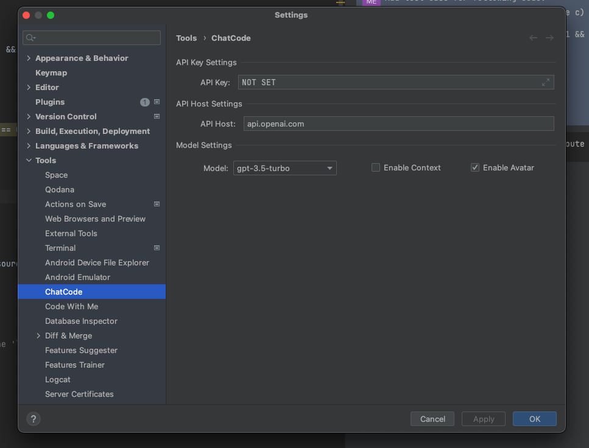
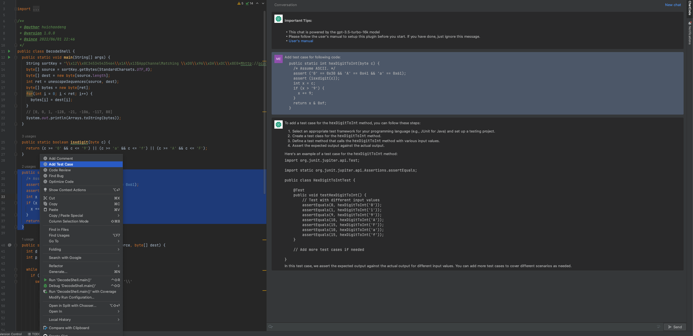
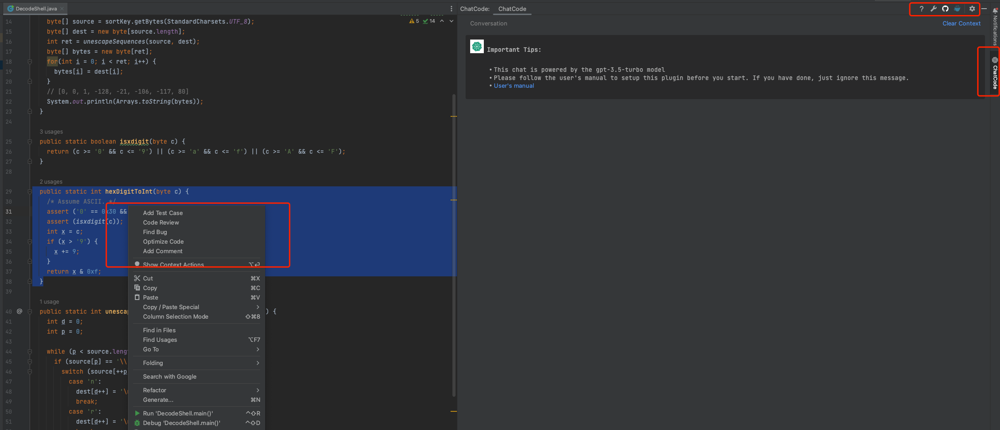

# About ChatGPT

[ChatGPT](https://chat.openai.com/chat) is a language model trained by OpenAI and can be used for a variety of tasks,
including dialogue and text generation. ChatGPT is a neural network-based model that is trained on large amounts of
human language data and is able to generate natural language text that is meaningful in a given context. The model can
be used for many applications, such as natural language processing
(NLP) and dialogue systems.

# About this project

This is a plugin powered by OpenAI and helps coders testing, optimizing, reviewing their code and improving their productivity.

# Installation

Install using the IDE's built-in plugin system:

<kbd>Settings/Preferences</kbd> > <kbd>Plugins</kbd> > <kbd>Marketplace</kbd> > <kbd>Search for "ChatCode"</kbd> >
<kbd>Install Plugin</kbd>

# Configuration And Usage

# License

This project uses the "GNU General Public License Agreement V2". and additional restrictions: it is forbidden to use the
code of this project to build other plug-in products of JetBrains Marketplace. Offenders will be punished.

# Disclaimers

This is not an official OpenAI product, and I am not responsible for any damage caused by the use of this plugin.
